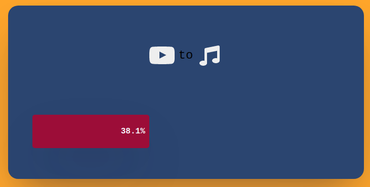
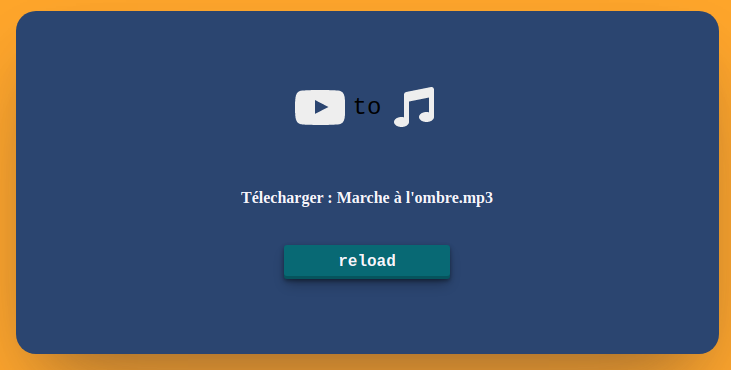

# youtube-dl


## Interface graphique pour youtube-dl
Télécharger vos musiques favorites sur youtube.  

L'application va garce au child_process (https://nodejs.org/api/child_process.html) faire tourner en font tache le logiciel youtude-dl (https://youtube-dl.org/) a la demande du client.

  

Le serveur revoie la progression en "real time" au client grace au module socket.io 
  

## Installation:

### Installer youtube-dl

To install it right away for all UNIX users (Linux, OS X, etc.)
``` 
sudo curl -L https://yt-dl.org/downloads/latest/youtube-dl -o /usr/local/bin/youtube-dl

sudo chmod a+rx /usr/local/bin/youtube-dl
```
ou http://ytdl-org.github.io/youtube-dl/download.html

## Installer ffmpeg

```
sudo apt install ffmpeg 
```

## Npm install
Installer express et socket.io

```
npm i 
```

## Start application
```
npm start
```

  