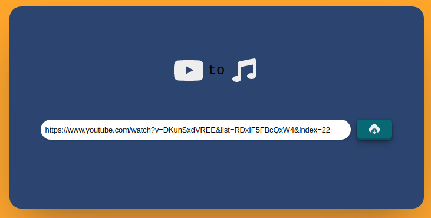

# :headphones: youtube-dl


## Interface graphique pour youtube-dl

**Téléchargez vos musiques favorites sur youtube !** :notes:


L'idée derrière ce projet et de travailler avec les child process et d'expérimenter dans un cas concret avec les webScoket

L'application,  par le biais du child_process https://nodejs.org/api/child_process.html  </br> va faire tourner en fond de tâche le logiciel youtube-dl https://youtube-dl.org/  
à la demande du client.

Grâce au module socket.io, le serveur renvoie la progression du téléchargement en temps réel au client.  

  


## Installation de l'application


### Node
  1. Télécharger la version LTS de NodeJS [ici](https://nodejs.org/fr/download/)
  2. Suivre les étapes d'installation en laissant les options par défaut.

Version de Node v18.1.0

### Installer youtube-dl

Commande ci-dessous pour UNIX (linux, macOS, etc.)
``` 
sudo curl -L https://yt-dl.org/downloads/latest/youtube-dl -o /usr/local/bin/youtube-dl

sudo chmod a+rx /usr/local/bin/youtube-dl
```
Source : http://ytdl-org.github.io/youtube-dl/download.html

### Installer ffmpeg

```
sudo apt-get install ffmpeg 
```

## Exécution

1. Ouvrir une invite de commande à la racine du projet
2. S'assurer d'avoir les dépendance npm installées 
```
npm install
```
3. Exécuter 
```
npm run start
```
 
Puis :
4. Ouvrir un navigateur à l'adresse [http://localhost:3000/](http://localhost:3000/)
